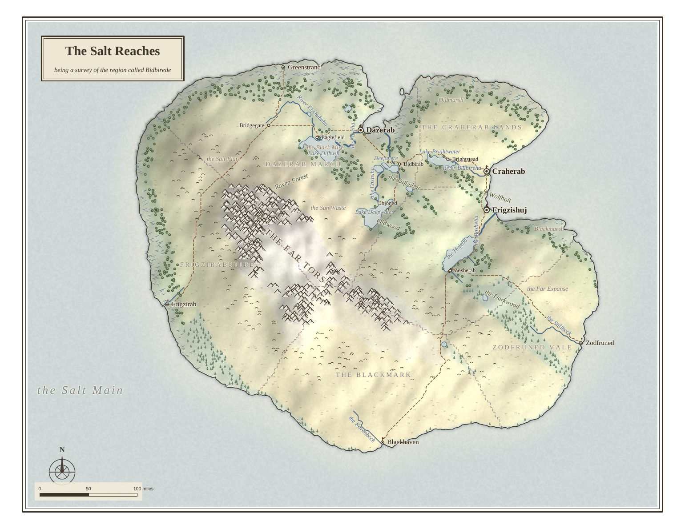
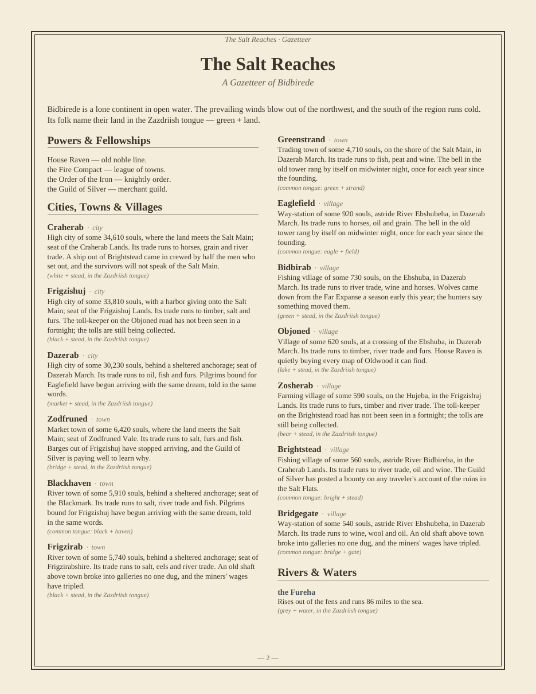

# Landloom

**Weave a world from a phrase.**

Landloom is a command-line world generator for game masters, writers, and
anyone who needs a fantasy region that holds together. You give it a seed
phrase; it gives you back a print-ready PDF atlas — a full-page antique-style
map, followed by a typeset gazetteer of every city, river, forest, and rumor
on it. The same phrase always weaves the same world, on any machine, so a
phrase *is* a world: share it in a campaign notes doc, a forum post, or a
book dedication, and anyone can pull up your exact map.



Everything on that page was decided by simulation, not decoration. Rivers
run downhill because rainfall was routed over eroded terrain. The desert
sits behind the mountains because the prevailing wind dropped its moisture
climbing them. The biggest city is a port at a river mouth because that is
where trade would actually pool. And every name has an etymology the
gazetteer can quote, in a language invented for that world alone.

## Install

With [uv](https://docs.astral.sh/uv/) (or `pipx`, same shape):

```
uv tool install "git+https://github.com/Lechemilk33/3rd-time-.git@claude/overnight-build-bpevb2"
```

or with plain pip:

```
pip install "git+https://github.com/Lechemilk33/3rd-time-.git@claude/overnight-build-bpevb2"
```

Python 3.10+ and nothing else — Landloom has **zero dependencies**, right
down to writing its PDFs byte by byte.

## Use

```
landloom "The Salt Reaches"
```

That writes `the-salt-reaches.pdf`: the map sheet plus a gazetteer. Other
things it can do:

```
landloom "emberfall" --paper poster        # 22x17" sheet for real printing
landloom "gloamwake" --shape isles         # force a landform: continent,
                                           #   coast, isles, or highlands
landloom "winterdeep" --hex 6              # hexcrawl overlay, 6 mi/hex
landloom "quiet harbor" --preview          # ANSI map in your terminal
landloom "salt march" --json world.json    # the raw data, for your own tools
landloom                                   # no phrase: weaves a random one
landloom --help                            # everything else
```

Generation takes a few seconds. A phrase is normalized before use
(`"Emberfall "` and `"emberfall"` are the same world), and anything is a
valid phrase — names, sentences, dates, in-jokes.

## What the atlas contains

- **The map sheet** — shaded relief, coastlines with waterlines, rivers that
  widen as tributaries join them, lakes, biome washes from glacier to
  rainforest, mountain/forest/marsh glyphs, province borders and tints,
  roads with bridges, sea lanes between ports, settlement symbols ranked
  city/town/village, a compass, a scale bar in miles, and a title cartouche.
- **The gazetteer** — every settlement with population, trade goods, its
  province, and a rumor a game master can run with; every named river with
  its source and measured length; the wild country (ranges, forests, fens,
  wastes); and notes on the world's own language, so you can coin new names
  that fit.
- **Etymologies throughout** — names are compounds of generated roots
  (`Aldmere — "old + lake"`), and the same root recurs across the map
  wherever the land repeats itself.

## How it thinks

Landloom is a pipeline of small simulations, each feeding the next:
fractal terrain is carved by stream-power erosion; rainfall is blown
across the result by a prevailing wind, losing moisture over high ground;
rivers are traced from the drainage; settlements are scored on water,
flatness, climate, and trade access; roads are routed over the terrain
with a real pathfinder; provinces grow outward from their seats by travel
cost; a phonology is generated and a lexicon derived from it; and finally
the labels on the map are placed by simulated annealing, the way
cartographers' software does it. Nothing is drawn by hand and nothing is
looked up from a stock list — which is why the geography, the economy, and
the names all agree with each other.

## Honest limits

- Landloom makes **regions**, not planets, dungeons, or battle maps. One
  phrase, one region, a few hundred miles across.
- The prose is assembled from templates over real world data. It is
  varied and grounded, but it is not a novelist; read it as a starting
  point, not a finished setting bible.
- The invented languages are naming languages — sound systems and word
  roots — not full grammars you could speak.
- Cultural texture beyond names (religions, politics, history) is
  shallow: factions and rumors, not chronicles.
- There is no editor. If you want to move a city, the tool is not for
  that; weave another phrase instead — they are free.

## Examples

Pre-woven atlases live in [`examples/`](examples/):
[The Salt Reaches](examples/the-salt-reaches.pdf) (a continent),
[winterdeep](examples/winterdeep.pdf) (a highland lake country),
[gloamwake](examples/gloamwake.pdf) (isles).



## License

MIT. The atlases you generate are yours.
